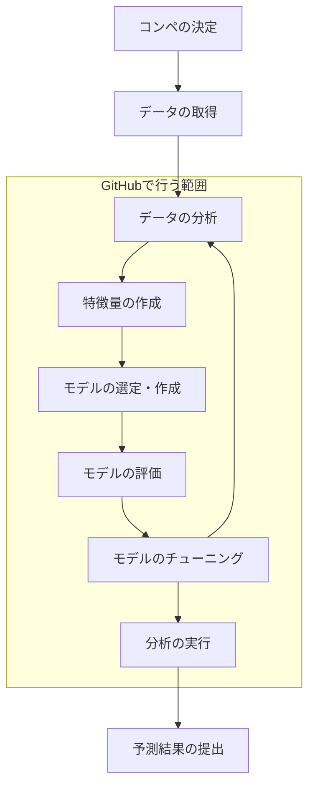

```mermaid
graph TD
comp["コンペの決定"] --> getData
getData["データの取得"] --> analyzeData
subgraph github["GitHubで行う範囲"]
tuneModel --> analyzeData
analyzeData["データの分析"] --> makeFeature
makeFeature["特徴量の作成"] --> makeModel
makeModel["モデルの選定・作成"]--> evaluateModel
evaluateModel["モデルの評価"] --> tuneModel
tuneModel["モデルのチューニング"] --> doAnalysis
end
doAnalysis["分析の実行"] --> submitData
submitData["予測結果の提出"]
```

